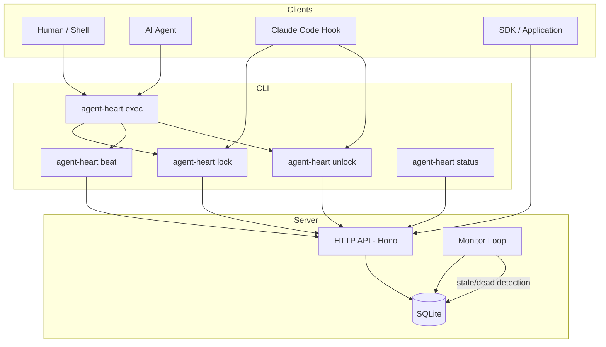
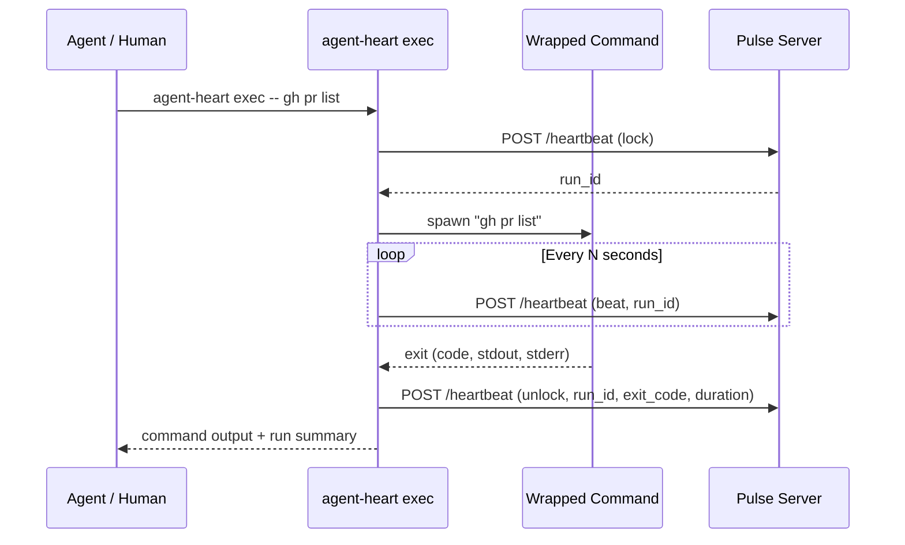

# Architecture

## Core Lifecycle Model

Every tracked execution in `agent-heart` is a **Run**. Runs follow a deterministic lifecycle:

```
  lock        beat (periodic)       unlock
   |               |                  |
   v               v                  v
[locked] -----> [active] -------> [completed]
                   |                  |
                   |              [failed] (exit_code != 0)
                   |
              (no heartbeat)
                   |
               [stale] ----------> [dead]
           (exceeded cycle)    (exceeded silence)
```

### States

| State | Meaning | How it happens |
|---|---|---|
| `locked` | Run has started, no heartbeat yet | `lock` action received |
| `active` | Run is progressing | `beat` action received after lock |
| `completed` | Run finished successfully | `unlock` action with exit_code 0 |
| `failed` | Run finished with error | `unlock` action with exit_code != 0 |
| `stale` | Run exceeded expected cycle time | Monitor detects elapsed time > `expected_cycle_ms` |
| `dead` | Run stopped sending heartbeats entirely | Monitor detects silence > `max_silence_ms` |

### Actions

| Action | Effect |
|---|---|
| `lock` | Creates a new run in `locked` state. Returns a `run_id`. |
| `beat` | Updates `last_heartbeat` timestamp. Transitions `locked` to `active`. |
| `unlock` | Marks the run as `completed` or `failed`. Records exit code and duration. |

### Timing Parameters

- **`expected_cycle_ms`** -- how long a run is expected to take from lock to unlock. If exceeded, the run is marked `stale`. Default: 5 minutes.
- **`max_silence_ms`** -- how long since the last heartbeat before a run is marked `dead`. Default: 10 minutes.

Both can be configured per-service in `~/.agent-heart/config.json`.

## System Components



### CLI (`agent-heart`)

The command-line binary. Used directly by humans, called by agents, or invoked from hook scripts. Communicates with the server over HTTP.

Key commands:
- `exec` -- wraps a command with automatic lock/beat/unlock
- `lock` / `beat` / `unlock` -- manual lifecycle control
- `status` -- query current state
- `server start` -- launch the local server
- `init` -- set up configuration

### Client SDK (`PulseClient`)

TypeScript class for programmatic integration. Same HTTP API as the CLI, but usable from Node.js applications, agent frameworks, and automation scripts.

```typescript
import { PulseClient } from "agent-heart";

const client = new PulseClient({ serverUrl: "http://127.0.0.1:7778" });
```

### Server (Hono + SQLite)

Lightweight HTTP server that:
- Accepts heartbeat events (`POST /api/v1/heartbeat`)
- Stores runs in SQLite
- Serves status queries (`GET /api/v1/overview`, `GET /api/v1/runs`)
- Runs the monitor loop in-process

Designed to be self-hosted. No external database required.

### Monitor Loop

Background process that periodically scans active runs and transitions them:
- `locked` or `active` with elapsed time > `expected_cycle_ms` --> `stale`
- `stale` or `active` with silence > `max_silence_ms` --> `dead`

Runs on a configurable interval (default: 30 seconds).

### Database (SQLite)

Single-file SQLite database at `~/.agent-heart/pulse.db`. Stores:
- `runs` -- all tracked executions with full metadata
- `services` -- service-level configuration and aggregate state

No migrations framework yet -- schema is created on first server start.

## Data Model

### Run (First-Class Object)

The **Run** is the primary object in `agent-heart`. Every `lock` creates a new run. Every `beat` updates it. Every `unlock` closes it.

```typescript
interface Run {
  run_id: string;           // Unique identifier (nanoid)
  session_id: string | null; // Groups runs within an agent session
  service_name: string;      // Logical service (e.g., "github", "k8s")
  tool_name: string | null;  // CLI tool (e.g., "gh", "kubectl")
  command: string | null;    // Redacted command string
  command_family: string | null; // Command category (e.g., "pr", "get")
  resource_kind: string | null;  // Resource type (e.g., "pulls", "pods")
  resource_id: string | null;    // Specific resource identifier
  status: RunStatus;         // locked | active | completed | failed | stale | dead
  severity: Severity;        // ok | warning | critical
  message: string | null;    // Human-readable status message
  exit_code: number | null;  // Process exit code (set on unlock)
  duration_ms: number | null; // Total run duration (set on unlock)
  started_at: string;        // ISO timestamp
  last_heartbeat: string;    // ISO timestamp of last beat
  completed_at: string | null; // ISO timestamp (set on unlock)
  metadata: Record<string, string>; // Arbitrary key-value pairs
}
```

### Session

Sessions are not a separate object -- they are a `session_id` string that groups related runs. A Claude Code session might have dozens of runs (one per tool call), all sharing the same `session_id`.

### Service

Services are logical groupings defined in configuration. Each service has its own timing thresholds:

```typescript
interface ServiceConfig {
  name: string;
  expected_cycle_ms: number;
  max_silence_ms: number;
}
```

## API Endpoints

### `POST /api/v1/heartbeat`

Send a lifecycle event.

```json
{
  "service_name": "github",
  "action": "lock",
  "tool_name": "gh",
  "resource_kind": "pulls",
  "session_id": "sess_abc123",
  "message": "Listing pull requests"
}
```

Response:

```json
{
  "ok": true,
  "run_id": "run_xyz789",
  "service_name": "github",
  "action": "lock",
  "status": "locked",
  "timestamp": "2026-03-06T12:00:00.000Z"
}
```

### `GET /api/v1/overview`

Returns aggregate state across all services.

### `GET /api/v1/runs`

List runs with optional filters: `?service=github&status=stale&session_id=sess_abc123&limit=50`

### `GET /api/v1/runs/:run_id`

Get a single run by ID.

## Exec Wrapper Flow

The `exec` command is the highest-leverage feature. Here is the full flow:



If the CLI process is killed before unlock, the server's monitor loop will detect the missing heartbeats and transition the run through `stale` to `dead`.
